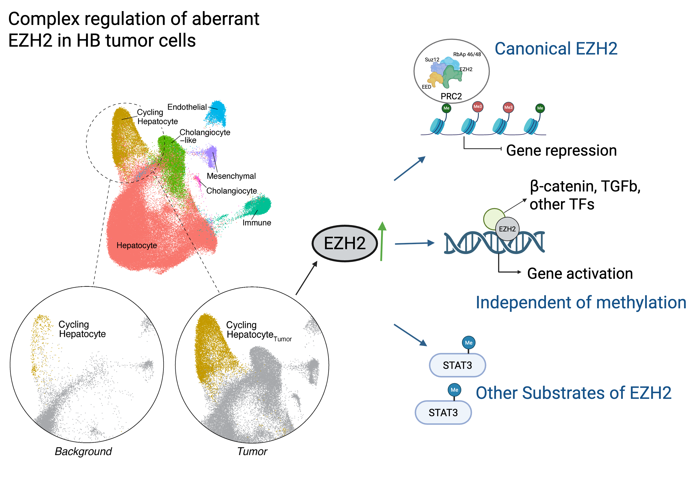

# EZH2 Overexpression in Hepatoblastoma: Implications for Mitotic Regulation and Therapeutic Potential

## Paper Citation
TBD

## Project Description
Background: Hepatoblastoma (HB) is the most common malignant liver tumor in children, characterized by histological heterogeneity and limited treatment options for advanced disease. Enhancer of Zeste Homolog 2 (EZH2), a histone methyltransferase and core component of the Polycomb Repressive Complex 2 (PRC2), is frequently overexpressed in HB and has been implicated in tumor progression. 
Methods: We investigated the role of EZH2 in HB using immunohistochemistry, gene expression profiling, and functional assays in HB cell lines and patient-derived xenografts. We examined both canonical (H3K27me3-mediated) and noncanonical (protein–protein interaction-based) mechanisms of EZH2 activity, with a focus on its interaction with mitotic regulators such as Aurora kinase B (AURKB). 
Results: EZH2 overexpression was associated with increased proliferation, chromosomal instability, and maintenance of a stem-like tumor cell population. Canonical EZH2 activity led to repression of differentiation-associated genes, while noncanonical interactions with AURKB contributed to mitotic dysregulation. EZH2-high tumors exhibited enhanced epithelial-to-mesenchymal transition (EMT) and immune evasion signatures. Pharmacologic inhibition of EZH2 reduced tumor growth and sensitized cells to mitotic inhibitors. 
Conclusions: EZH2 promotes HB progression through both epigenetic silencing and noncanonical signaling pathways. These findings support EZH2 as a central driver of HB aggressiveness and a promising therapeutic target, particularly in combination with agents targeting mitotic machinery. 
