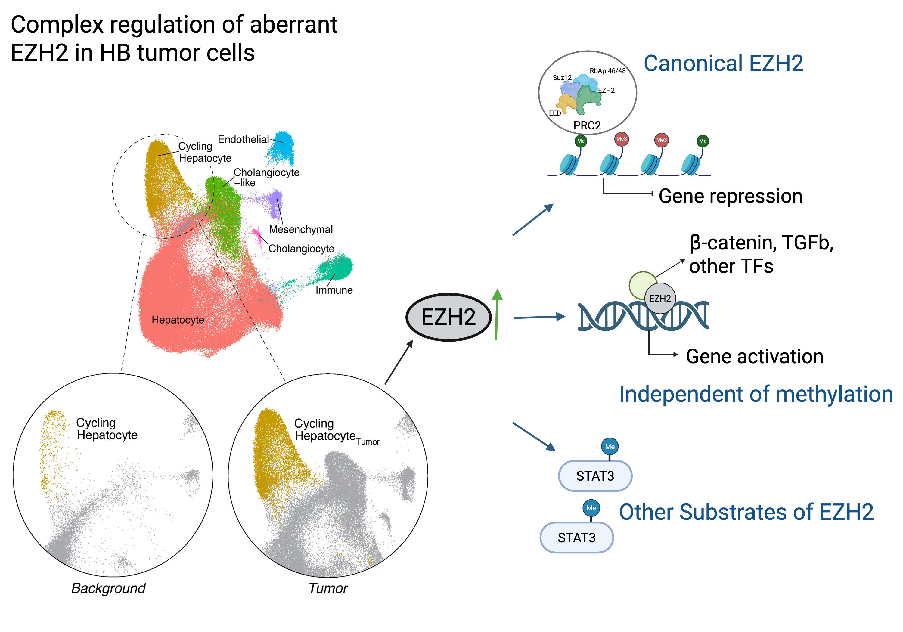

# EZH2 Overexpression in Hepatoblastoma: Implications for Mitotic Regulation and Therapeutic Potential

## Paper Citation
TBD

## Project Description
Hepatoblastoma (HB) is the most common pediatric liver malignancy, yet its cellular origins and molecular drivers remain poorly defined. Using single-nuclear RNA sequencing (snRNA-seq), we identified a proliferative, hepatocyte-derived tumor cell population (cycling HepT) enriched for EZH2 expression, particularly in the aggressive embryonal subtype. Integrative genomic and transcriptomic profiling confirmed EZH2 overexpression. Disruption of the PRC2 complex was evident through mislocalization and reduced expression of SUZ12, a core component. EZH2 overexpression correlated with upregulation of mitotic regulators such as AURKB and Ki67 in human HB gene expression analysis as compared to background liver. Targeted sequencing identified variants of uncertain significance in EZH2 and SUZ12 in 11 of 11 patient tumors. Pharmacologic inhibition of EZH2 with EPZ-6438 reduced proliferation and sensitized HB cells to cisplatin through gene regulation, potentially modulating platinum accumulation both in vitro and in vivo. In summary, EZH2 promotes HB progression through both epigenetic silencing and noncanonical signaling pathways. These findings support EZH2’s contribution to HB pathogenesis, therefore identifying it as a novel therapeutic target 

## Processing Steps
### Main Pipeline Scripts
The following scripts were used in order to perform the following tasks: 
0. Integration and label transfer for all samples (0_seurat_log_noLung.R)
1. Integration and label transfer for background samples only (1_seurat_log_background.R)
2. Perform subclustering on background (2_Subcluster_Background.R)
3. Add sample metadata to all samples (3_UMAP_metadata.R)
4. Add background-defined cell type labels to full object with all samples (4_Add_clusters_from_background.R)
5. Subcluster at various additional resolutions and create h5ad file for final object (5_MultiRes_and_h5ad.R)
6. All code required to create the panels for the first single-cell figure (6_8Nov2024_PrelimFigs_scFig1.R)
7. All code required to create the panels for the second single-cell figure (7_11Dec2024_PrelimFigs_scFig2.R)